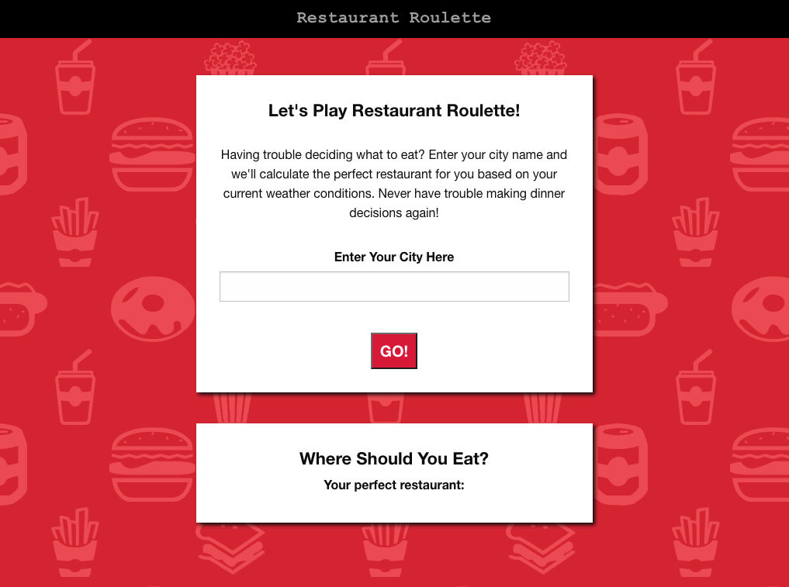

# Project-1-Restaurant-Roulette

PROJECT DESCRIPTION
Project #1 for Northwestern University's Full Time Coding Bootcamp program. Divided into team to conceive and execute a design that solves a real-world problem by integrating data received from multiple server-side API requests. Learn agile development methodologies and implement feature and bug fixes using the git branch workflow and pull requests. Key topics include: server-side APIs, git branching and workflow, agile software development.

RESTAURANT ROULETTE
Our group, Project Ninjas, choose to create an application that returns a random restaurant selection based on the users city location and current weather conditions. The use case if for individuals who have a hard time deciding which restaurant to go to, and would like someone else to choose for them. When the user enters their city they are presented with their current weather conditions and one restaurant selection (with additional information included below about the restarant). This application will help individuals make quicker decisions, and potentially expand their taste in restaurants. If the user doesn't like the restaurant choice they received, they can always enter their city again for a new choice.

SCREENSHOTS

TEAM
Team contibutors include Kevin Miller (project manager), Alex Eesley, and Flory Ann Evia. All contibutors are students in the Coding Bootcamp mentioned above.

TECHNOLOGIES USED
The Restaurant Ninjas used the following technologies to build the application:
- Foundations https://get.foundation/
- Open Weather API (free version): https://openweathermap.org/api
- Zomato API (free version): https://developers.zomato.com/api
- HTML, CSS, Jquery

FUTURE DEVELOPMENT
In future development iterations we would like to add different options where the user may select whether they are looking to dine out or order for delivery. We would also like to develop dynamic restaurant responses that adjust based on the weather. For example, if the user selected "dine out" and it was sunny, we would include restaurants with outdoor patio seating and highlight that for the user.